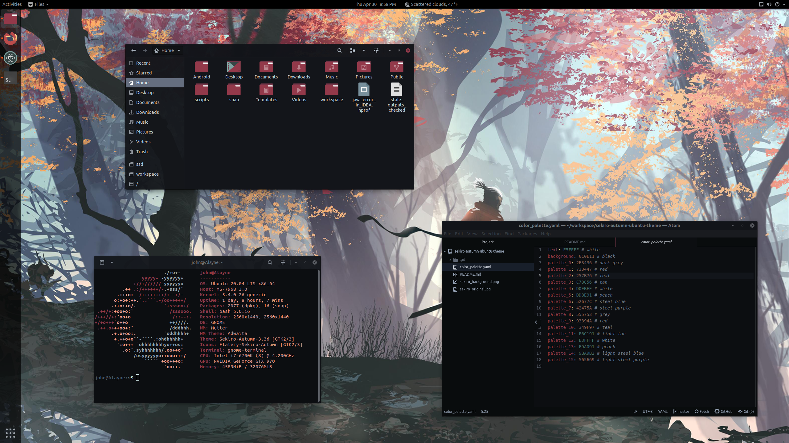

## Preface

I did not create the backgrounds, and all of the themes/icon pack are based off of other people's open source work.  I just edited colors to match the background.

## Instructions
Apply one of the backgrounds in this repo.    
For terminal, check out [the color palette](https://github.com/JohnOberhauser/sekiro-autumn-ubuntu-theme/color_palette.yaml) for the profile colors.    
Add    
`neofetch --ascii_colors 14 9 13 --colors 9 9 9 9 9 13 --color_blocks off --ascii_distro ubuntu_old`    
at the end of your .bashrc    

[Icon Theme](https://github.com/JohnOberhauser/sekiro-autumn-icons)    
[Gnome Shell and Application Theme](https://github.com/JohnOberhauser/sekiro-autumn-gnome-theme)    
[Atom Syntax Theme](https://atom.io/themes/sekiro-autumn-syntax)    
[Atom UI Theme](https://atom.io/themes/sekiro-autumn-ui)    

